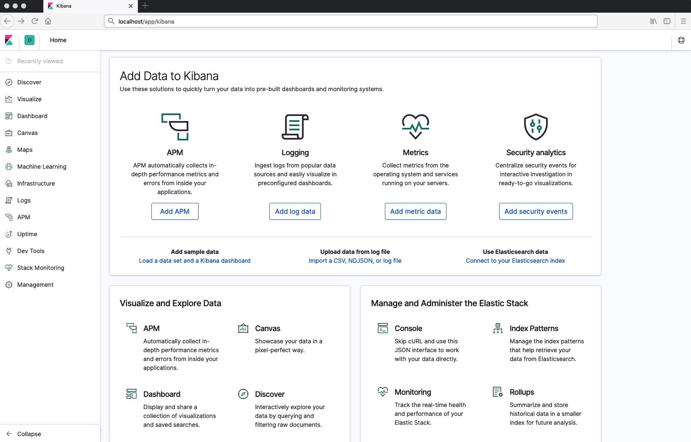

# Elasticsearch & Kibana setup

This repository contains instruction how to setup elasticsearch and kibana (EK) stack from the scratch.
To get familiar what is `elasticsearch` please refer to https://www.elastic.co. 
And to get more information about `kibana` please take a look at https://www.elastic.co/products/kibana.

**Content**
- Used tools
- EK configuration
- Usage
- Demo
- Contribution

## Used tools
- docker (`docker --version` >= `18.06.0`)
- docker-compose (`docker-compose --version`  >= `1.22.0`)
- Elasticsearch 7.0.0
- Kibana 7.0.0

## EK configuration
EK stack could be hosted on your local machine on VM as wel. First what you need is to allocate system resources with memory limit:
```bash
sysctl -w vm.max_map_count=262144
```
If you are a linux user you have to open _/etc/sysctl.conf_ configuration file and add following line to it:
```bash
vm.max_map_count=262144
```
If you are a Mac OS user please follow next steps:
```bash
screen ~/Library/Containers/com.docker.docker/Data/vms/0/tty
``` 
Then configure the _sysctl_ setting:
```bash
sysctl -w vm.max_map_count=262144
```
Exit by _cntr-a_ _cntr-\/_ commands

**Note** for Mac OS user you will need to change docker memory allocation to `4-8Gib`

## Usage
Run following docker-compose command:
```bash
docker-compose up -d
```
Check status by running:
```bash
curl http://127.0.0.1:9200/_cat/health
```
You should get output like following:
```bash
1555572353 07:25:53 docker-cluster green 2 2 4 2 0 0 0 0 - 100.0%
```
To start working with EK stack please open `localhost/app/kibana` in your browser. Please wait a bit for `Kibana server is not ready yet` message to disappear.

To stop EK stack please execute following command
```bash
docker-compose down
```
**Note** if you stuck with errors that some of docker containers are dropped please follow next instructions
```bash
sudo chmod -R a+rwx elasticsearch/data
```
```bash
sudo chmod -R a+rwx elasticsearch2/data
```

## Demo
**Kibana WEB UI**


## Contribution
- clone the repository
- configure Git for the first time after cloning with your name and email
  ```bash
  git config --local user.name "Volodymyr Yahello"
  git config --local user.email "vyahello@gmail.com"
  ```

